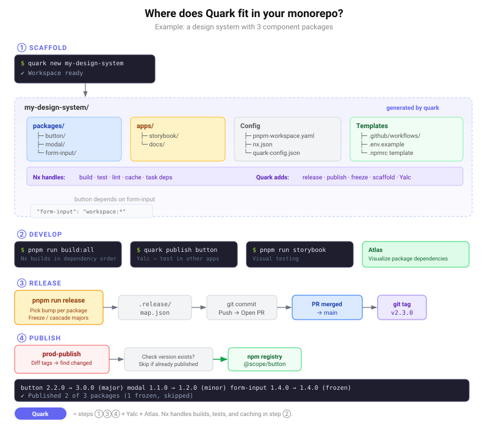

<!--
  Licensed under the MIT License. See LICENSE for details.
-->

<h1 align="center">
  <strong>Quark — Polyglot Monorepo Framework</strong>
</h1>

<p align="center">
  
  <a href="https://github.com/ackotech/quark/blob/main/LICENSE">
    
  </a>
  <a href="https://github.com/ackotech/quark/actions">
    
  </a>
  <a href="https://www.npmjs.com/package/@quark-hq/quark">
    
  </a>
  <a href="https://github.com/ackotech/quark/stargazers">
    
  </a>
  <a href="https://github.com/ackotech/quark/graphs/contributors">
    
  </a>
  <a href="https://github.com/ackotech/quark/commits/main">
    
  </a>
</p>

<p align="center">
  CLI tooling, release automation, and dependency visualization for component libraries — extensible across languages and platforms.
</p>

---

Quark provides CLI tooling, release automation, and a dependency visualization
app so teams can scaffold, develop, test, and publish packages from a single
workspace. It supports multiple platforms (Node and Maven today) via pluggable
adapters, making it extensible to any language or build system.

<p align="center">
  
</p>

## Why Quark?

Tools like **Nx**, **Turborepo**, and **Lerna** are excellent at what they do —
task orchestration, caching, and dependency-aware builds. Quark doesn't replace
them; it uses Nx under the hood and builds on top of it. Quark exists because
managing a component library at scale surfaces problems that build tools alone
don't solve:

- **One-command workspace setup** — `quark new` scaffolds a complete monorepo
  with pnpm workspaces, Nx, Storybook, CI templates, registry config, and
  environment templates. No boilerplate assembly required.

- **Interactive release with freeze & cascade** — When a major version bump
  would break downstream packages, Quark lets you choose: cascade the bump to
  all dependents, freeze them at their current versions, or selectively pick
  which packages to freeze. The release map (`.release/map.json`) tracks every
  decision so production publishes are deterministic.

- **Multi-registry publish with safety checks** — Publish to dev and production
  registries in a single flow. Quark checks whether a version already exists
  before publishing, restores original `package.json` and `.npmrc` on failure,
  and validates scoped package names and auth tokens upfront.

- **Polyglot platform adapters** — Node and Maven are supported today via
  pluggable adapters. Adding a new language means implementing one adapter
  interface — the release, publish, and graph logic stays the same.

- **Dependency visualization** — Atlas renders your workspace's package graph in
  the browser, making it easy to understand what depends on what before you cut
  a release.

In short, Quark is the layer between your build system and your release process
— the part that turns "we have a monorepo" into "we can ship packages safely."

## Scope

This repository contains:

| Package | Description |
| ------- | ----------- |
| [`@quark-hq/quark`](cli/quark-cli) | CLI for creating workspaces, scaffolding packages (Vite/Webpack), and local Yalc publish/link workflows |
| [`@quark-hq/quark-scripts`](cli/quark-scripts) | Release, dev publish, and production publish automation for pnpm + Nx monorepos |
| [`@quark-hq/quark-security`](cli/quark-security) | Shared path, spawn, and validation helpers used by Quark tooling |
| [`@quark-hq/atlas`](atlas) | Next.js app for visualizing package dependency graphs and release metadata |

Projects created with `quark create` receive GitHub workflow templates, Storybook
scaffolding, registry configuration, and the scripts wired in this boilerplate.

## Platform Support

Quark currently supports **macOS** and **Linux** only. Windows (cmd / PowerShell) is **not supported**.

## Requirements

- **Node.js** v20+ (v18+ minimum for CLI consumers)
- **pnpm** 9.x (see root `package.json` for the pinned version)

## Getting Started

### Install dependencies

From the repository root:

```bash
pnpm install
```

### Build all packages

```bash
pnpm run build:all
```

### Run tests

```bash
pnpm --filter @quark-hq/quark run test
pnpm --filter @quark-hq/quark-scripts run test
pnpm --filter @quark-hq/quark-security run test
```

### Atlas (dependency graph UI)

```bash
pnpm --filter @quark-hq/atlas run dev
```

### Storybook

When a Storybook app is present in a scaffolded workspace:

```bash
pnpm run storybook
```

Build packages first with `pnpm run build:all` if Storybook depends on built artifacts.

## Usage

### Install the CLI globally

```bash
npm install -g @quark-hq/quark
```

### Create a new workspace

```bash
quark new my-project
cd my-project
pnpm install
```

This scaffolds a pnpm workspace with example packages, Storybook, release scripts,
and environment configuration templates.

### Add a package to an existing workspace

```bash
cd packages
quark create my-component
```

Choose **Vite** or **Webpack** when prompted.

### Local development with Yalc

```bash
# In the package directory
pnpm run build
quark publish my-component

# In a consuming project
quark link my-component
```

Use `quark publish my-component --push` to push updates to linked consumers.
Remove links with `quark remove my-component` or `quark remove --all`.

### Publishing workflow

1. Configure registry credentials in `.env` (see keys in `cli/quark-cli/src/init/constants.ts`).
2. Publish alpha builds for testing:

   ```bash
   pnpm run publish:dev
   ```

3. Create a production release on `main`:

   ```bash
   pnpm run release
   ```

4. Commit the generated release map and push. GitHub Actions templates included
   in scaffolded projects handle tagging and registry publish.

See [CONTRIBUTING.md](CONTRIBUTING.md) for development setup and pull request
guidelines.

## Repository Layout

```text
quark/
├── atlas/                 # Dependency graph visualization app
├── cli/
│   ├── quark-cli/         # @quark-hq/quark
│   ├── quark-scripts/     # @quark-hq/quark-scripts
│   └── quark-security/    # @quark-hq/quark-security
├── packages/              # Component packages (scaffolded in consumer projects)
├── quark-config.json      # Release and freeze configuration
├── pnpm-workspace.yaml
└── package.json
```

## Configuration

Release behavior is controlled by `quark-config.json`:

```json
{
  "release": {
    "excludePackages": [],
    "autoCommit": false,
    "masterBranch": "main",
    "freeze": false
  }
}
```

Registry URLs and auth tokens are read from `.env` at publish time.

## Support Status

| Area | Status |
| ---- | ------ |
| `@quark-hq/quark` CLI (`new`, `create`, Yalc commands) | Active development |
| `@quark-hq/quark-scripts` release and publish flows | Active development |
| `@quark-hq/atlas` | Active development |
| Published npm packages | Best-effort; pin to released versions in production |
| Community support | GitHub Issues on a best-effort basis — no SLA |

This project is maintained by [Acko Technologies](https://github.com/ackotech).
Breaking changes may occur before a stable 1.0 release. Check release notes and
tags before upgrading in production monorepos.

## Security

- Report vulnerabilities privately via [SECURITY.md](SECURITY.md). Do not open
  public issues for security findings.
- CLI tooling uses `@quark-hq/quark-security` for path confinement and safe
  process spawning. Do not bypass these helpers in new code.
- Static analysis (Bearer) runs against this repository; see `bearer.yml`.
- Never commit registry tokens, `.npmrc` credentials, or `.env` secrets. Example
  env templates use placeholder values only.

## License

This project is licensed under the [MIT License](LICENSE). See [NOTICE](NOTICE)
for third-party attribution.

## Get Involved

- [GitHub Issues](https://github.com/ackotech/quark/issues) — bug reports, feature requests, and questions
- [GitHub Discussions](https://github.com/ackotech/quark/discussions) — open-ended conversations and ideas

Contributions are welcome and greatly appreciated. Every bit helps, and credit
will always be given. See [CONTRIBUTING.md](CONTRIBUTING.md) to get started.

## Resources

| Resource | Link |
| -------- | ---- |
| Contributing Guide | [CONTRIBUTING.md](CONTRIBUTING.md) |
| Security Policy | [SECURITY.md](SECURITY.md) |
| Code of Conduct | [CODE_OF_CONDUCT.md](CODE_OF_CONDUCT.md) |
| License | [MIT](LICENSE) |
| Third-Party Notices | [NOTICE](NOTICE) |
